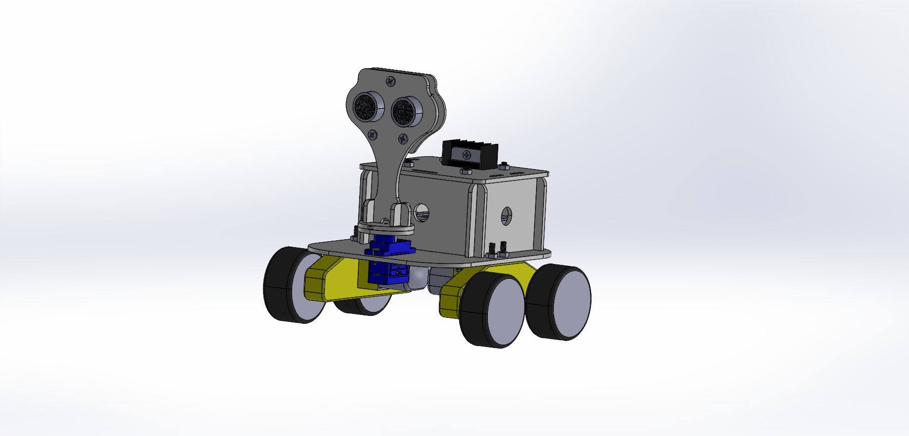

# Maze_Robot_Implementation
Implementing a maze robot with a minimum number of sensors

# Introduction
This is a research project that was carried out to improve the algorithm, but in addition to the algorithmic challenges, we have faced many challenges, including the construction challenge, to be able to build this robot with minimal dimensions. This robot is built with a minimum number of sensors and can find the way out of the maze and, during its movement, maintain a horizontal distance from the walls of the maze at any time and adjust its speed by estimating the distance to the obstacles in front of it. As it is shown below it has a fine mechanical architecture that cause difficulties in designing and assembling.

The design of the mechanical parts of this robot was a bit challenging because not only were the electronic modules small and sensitive to impact, but their assembly was a difficult task that had to be taken into account during the design. In building this robot, minimal design was one of the essential factors in its construction.

